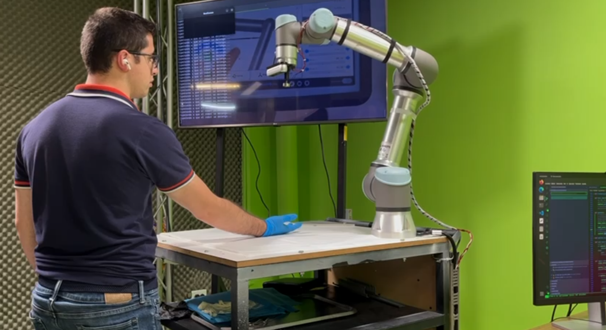

# 🤖 UR5_SRUB_NURSE — S.I.L.V.I.A. | **Surgical Instrument Logistics Virtual Intelligent Assistant**

Repositorio para el trabajo con el robot UR5 utilizando una cámara de profundidad para la detección de instrumental quirúrgico mediante inteligencia artificial.


---

## 🔗 **Documentación**
Se puede revisar un reporte del proyecto y videos en la carpeta **Manual_and_docs**.
- [Reporte e instructivo PDF](Manual_and_docs/UR5%20-%20Reporte%20de%20documentación.pdf)
> **Nota**: En este reporte se muestra una documentación de los antecedentes y justificación del proyecto, y la documentación técnica de como se elaboró todo el proyecto.

---

## 🔗 **Reconocimientos y articulos**
El proyecto a participado en:
- **Expo Universidad Iberoamericana Puebla Otoño 2023** (2023).
- **Expo Ingenierías Universidad Iberoamericana CDMX** (2024).
- **Expo Universidad Iberoamericana Puebla Primavera 2024** (2024).
- **XIV Congreso Nacional y IV Internacional de Tecnología aplicada a Ciencias de la Salud** (2024).
- **Conference IEEE Robotics at Boca del Rio, Veracruz, Mexico** (2024).
- **Expo Universidad Iberoamericana Puebla Otoño 2024** (2024).


- 🔗[ Articulo: Prototipo con reconocimiento de objetos para la asistencia en instrumentación quirúrgica](https://repositorio.iberopuebla.mx/handle/20.500.11777/5915)
- 🔗[ Articulo: IEEE Robotics](https://ieeexplore.ieee.org/document/10765997)

---

## ⚙️ **Sistema de Cambio Rápido de Herramental**

Adaptado por **JPHA**  

Archivos principales para el cambio de herramienta:
- **🔗 Base**
- **🔩 Cople**
- **🔒 Pestillo**

> **Nota**: Planos y archivos STEP en la carpeta **3D_Models**.

---

## 📚 **Conjunto de datos (Dataset) para instrumental quirúrgico**
Puedes encontrar el dataset que se contruyo con roboflow en **kaggle** en la siguiente liga:
- [Kaggle instrumentación](https://www.kaggle.com/datasets/jphajp/ur5e-srube-nurse-surgical-instruments/data)

---

## 📚 **Librerías Utilizadas**

- [Mediapipe](https://google.github.io/mediapipe/) 📷
- [Ultralytics](https://ultralytics.com/) 🧠
- `pyrealsense2` 🌐
- `numpy` 📐
- `cv2` 🎥
- [UR RTDE](https://sdurobotics.gitlab.io/ur_rtde/index.html) 🤖
- `ollama` 🦙
- [Whisper](https://github.com/openai/whisper) 🗣️
- `gradio` 🌉
- `gtts` 🔊
- `flask` 🌐

---

## 🐋 **UR en Docker**

Puedes acceder a la imagen de UR en Docker:
- [Universal Robots URSim e-Series](https://hub.docker.com/r/universalrobots/ursim_e-series)

---

## 🛠️ **Instalaciones adicionales**

Para que todo funcione correctamente, instala los siguientes paquetes:

```bash
sudo apt-get install portaudio19-dev
```

---

## 🔗 **Referencias adicionales**

### UR_RTDE
Documentación de UR_RTDE para la comunicación con el robot UR5:
- [UR RTDE Documentation](https://sdurobotics.gitlab.io/ur_rtde/index.html)

### Whisper
Sistema de transcripción de OpenAI para detección de voz:
- [Whisper en GitHub](https://github.com/openai/whisper)

### Llama3.1 (8B)
Para utilizar la inteligencia artificial de Llama, instala el modelo:
- [Descarga en Ollama](https://ollama.com/download)
- Comando de instalación:
  ```bash
  ollama pull llama3.1:latest
  ```

--- 

¡Explora, experimenta y disfruta mejorando la asistencia quirúrgica con **S.I.L.V.I.A.**! 👩‍⚕️🤖
